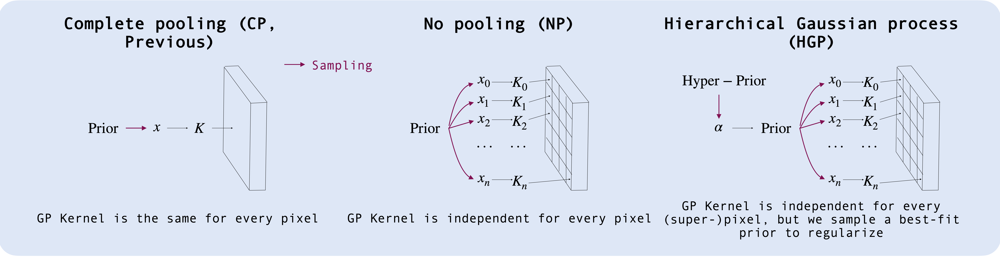

# Hierachical Gaussian process 21 cm foreground removal (H21F)

A Gaussian Process based 21-cm foreground separation code, including codes for sampling, separation, and evaluation.

## Introduction

> Gaussian Processes (GPs) have been extensively utilized as non-parametric models for component separation in 21~cm data analyses. This exploits the distinct spectral behavior of the cosmological and foreground signals, which are modeled through the GP covariance kernel. Previous approaches have employed a global GP kernel along all lines of sight (LoS). In this work, we study Bayesian approaches that allow for spatial variations in foreground kernel parameters, testing them against simulated HI intensity mapping observations. We consider a no pooling (NP) model, which treats each LoS independently by fitting for separate covariance kernels, and a hierarchical Gaussian Process (HGP) model, that allows for variation in kernel parameters between different LoS, regularized through a global hyper-prior. We find that accounting for spatial variations in the GP kernel parameters results in a significant improvement in the cosmological signal recovery, achieving up to a 30% reduction in the standard deviation of the residual distribution, and improved model predictive performance. Allowing for spatial variations in GP kernel parameters also improves the recovery of the HI power spectra and scattering coefficients. Whilst the NP model achieves superior recovery as measured by the residual distribution, it demands extensive computational resources, faces formidable convergence challenges and is more prone to over-fitting. Conversely, the HGP model strikes a balance between the accuracy and robustness of the signal recovery. Further improvements to the HGP model will require more physically motivated modelling of foreground spatial variations.

In the CP model, which has been used extensively in previous 21~cm component separation analyses, we sample a set of global kernel parameters for all LoS. For the NP model, we sample independent kernel parameters for every LoS. In the HGP model, the full datacube is divided into a set of super-pixels, with kernel parameters being shared amongst all LoS within a super-pixel. The kernel hyper-parameters are drawn from a learned prior, which is inferred through the use of a global hyper-prior over the prior parameters. This hyper-prior acts to regularize spatial variations in the kernel parameters and allows the sharing of information between different LoS.

## Presiquities

[JAX](https://jax.readthedocs.io), [numpyro](https://num.pyro.ai), [ArviZ](https://python.arviz.org/), [GPR4IM](https://github.com/paulassoares/gpr4im) (For evaluation only) and [Kymatio](https://www.kymat.io) (For evaluation only).

## Usage

### Data

This code has some specifically designed reading function to read the data in [this link](https://www.dropbox.com/sh/9zftczeypu7xgt3/AABiiBw_0SBPrLgSHsjiISz8a?dl=0), as is used in [Soares et al. 2022](http://dx.doi.org/10.1093/mnras/stab2594). Remember to change the data directory in each notebook or script if you're using this dataset.

### Sampling and Component Separation

For **CP** (conventional) method, the sampling and component separation are integrated into one notebook ([CP_sampling_prediction.ipynb](https://github.com/dkn16/GP21cmFg/blob/main/CP_sampling_prediction.ipynb)), as it is fast.

For **HGP** and **NP**, sampling codes are in the `Sampling` folder. After running the scripts there, one is supposed to get a pickled numpyro MCMC object. Be careful about the **directory** for saving the object.

After getting the object, use notebooks in `Prediction` folder to do the component separation.

suffix `_nopol` means only two kernels are adopted, one for modeling the foreground and one for modeling the 21 cm emission. `_pol` means three kernels are used, for foreground, polarization leakage and 21 cm, respectively.

The last parts in the prediction notebook shows the bias correction following Mertens et al.. It provides a method to conpensates for the lost large scale power due to calculating the expectation only.

### Post analysis and evaluation

See notebooks in `Evaluation` folder:

- `Visualization`: draw images of the recovered 21 cm signal.

- `Residuals`: calculate residuals of the recovered 21 cm signal.

- `Powerspectrum`: calculate the power-spectrum of the recovered 21 cm signal.

- `ST`: calculate the scattering transform coefficients of the recovered 21 cm signal.

## Acknowlegdements

please consider cite xxx-xxx-xxxx

This code is heavily based on `numpyro` and `JAX`. Please also consider site this two package.
